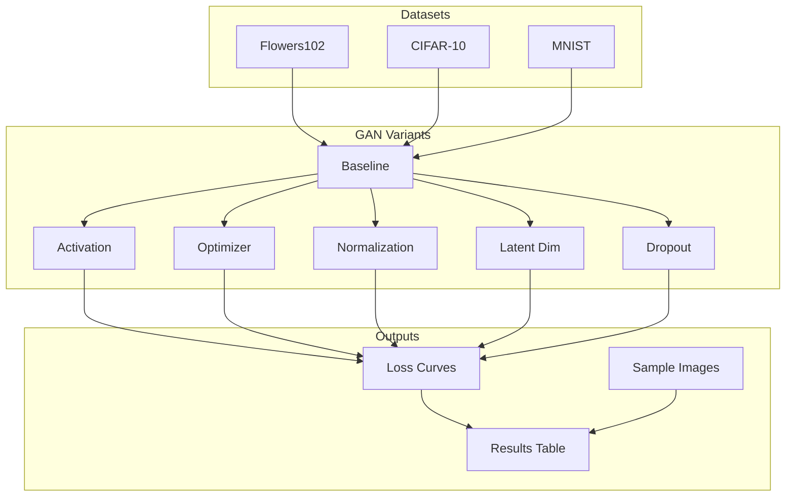

# NeuralNector Final Project Modification Plan

## Current Project Summary

**NeuralNector** is an interactive web game where players identify AI-generated vs real flower images. The backend uses a DCGAN-style architecture in [backend/scripts/models.py](backend/scripts/models.py):

- **Generator**: latent (100) → 4×4×512 → ConvTranspose layers → 64×64×3 (tanh)
- **Discriminator**: 64×64×3 → Conv layers (64→128→256→512) → 1 (sigmoid)
- **Training**: Label smoothing (0.1), asymmetric LRs (G: 0.0004, D: 0.0001), conditional D skip when d_loss < 0.6
- **Dataset**: Flowers102 (~8k train+val images, 64×64 RGB)
- **Framework**: PyTorch Lightning, Adam optimizer

The model already supports **28×28** (MNIST) and **64×64** (Flowers) via `image_size` and `channels` parameters.

---

## Part 1: Multiple Datasets

Add support for 2 additional datasets beyond Flowers102. The models already support 28×28 (grayscale) and 64×64 (RGB).

| Dataset        | Size  | Channels | Notes                                                       |
| -------------- | ----- | -------- | ----------------------------------------------------------- |
| **Flowers102** | 64×64 | 3        | Current primary dataset                                     |
| **CIFAR-10**   | 32×32 | 3        | Add 32×32 branch to models OR resize to 64×64               |
| **MNIST**      | 28×28 | 1        | Already supported in [models.py](backend/scripts/models.py) |

**Implementation approach:**

- Add a **32×32** branch to Generator/Discriminator in `models.py` (similar to existing 28/64 branches) for CIFAR-10
- Create a configurable training script or notebook that accepts `--dataset flowers102|cifar10|mnist`
- Use `torchvision.datasets.CIFAR10` and `MNIST` (both auto-download)

---

## Part 2: GAN Architecture Experiments (3-5)

Choose 5 experiments that modify the architecture meaningfully and are feasible to run:

### Experiment 1: Activation Functions (Generator)

- **Baseline**: ReLU in Generator
- **Variants**: LeakyReLU(0.2), GELU
- **Rationale**: Activation choice affects gradient flow; LeakyReLU/GELU can reduce dead neurons

### Experiment 2: Optimizer Comparison

- **Baseline**: Adam (lr=0.0002, betas=(0.5, 0.999))
- **Variant**: SGD with momentum (lr=0.01, momentum=0.9)
- **Rationale**: Standard hyperparameter comparison per assignment

### Experiment 3: Normalization Layers

- **Baseline**: BatchNorm2d in G and D
- **Variant**: LayerNorm or InstanceNorm2d
- **Rationale**: Normalization affects training stability; common GAN ablation

### Experiment 4: Latent Dimension

- **Baseline**: latent_dim=100
- **Variants**: 50, 256
- **Rationale**: Latent size affects expressiveness vs overfitting

### Experiment 5: Discriminator Regularization

- **Baseline**: No dropout in D
- **Variant**: Add Dropout2d(0.3) after conv layers in Discriminator
- **Rationale**: Dropout can prevent D from overpowering G

**Experiment tracking:** Log FID (if feasible), Inception Score, or qualitative sample grids. At minimum, log g_loss/d_loss curves and save sample images per epoch.

---

## Part 3: Report Structure

Create [report/neural_nector_final.tex](report/neural_nector_final.tex) using the existing ICML template in [report/example_paper.tex](report/example_paper.tex). Replace content with project-specific sections.

### Required Sections (>1,500 words total)

| Section             | Content                                                                                                                   | Est. Words |
| ------------------- | ------------------------------------------------------------------------------------------------------------------------- | ---------- |
| **a) Abstract**     | Problem, approach, datasets, key findings                                                                                 | 100-150    |
| **b) Introduction** | NeuralNector game, GAN for flower generation, motivation for multi-dataset + architecture study                           | 250-300    |
| **c) Method**       | GAN architecture (Generator/Discriminator), training procedure, datasets (Flowers102, CIFAR-10, MNIST), experiment design | 350-400    |
| **d) Experiment**   | Hyperparameters, training setup, results tables/figures for each experiment, analysis                                     | 400-500    |
| **e) Conclusion**   | Summary, limitations, future work                                                                                         | 150-200    |
| **f) References**   | GAN papers (Goodfellow et al.), DCGAN, dataset citations                                                                  | -          |

### Report Format

- Use existing [report/icml2023.sty](report/icml2023.sty) and related files
- Include figures: sample generated images, loss curves, comparison tables
- Add GAN-specific references (Goodfellow et al. 2014, Radford et al. DCGAN 2015)

---

## Implementation Files to Create/Modify

| File                                                                   | Action                                                                      |
| ---------------------------------------------------------------------- | --------------------------------------------------------------------------- |
| [backend/scripts/models.py](backend/scripts/models.py)                 | Add 32×32 branch, configurable activation/norm/dropout via constructor args |
| `backend/scripts/train_gan.py` or `models/GAN/train_experiments.ipynb` | New training script with `--dataset`, `--experiment` flags                  |
| [report/neural_nector_final.tex](report/neural_nector_final.tex)       | New report (copy from example_paper.tex, replace content)                   |
| [report/neural_nector_final.bib](report/neural_nector_final.bib)       | BibTeX for GAN/dataset references                                           |

---

## Data Flow Diagram

---

## Timeline Suggestion

1. **Phase 1**: Extend `models.py` with 32×32 support and experiment config flags
2. **Phase 2**: Create training script/notebook, run experiments (Flowers102 first, then CIFAR-10, MNIST)
3. **Phase 3**: Write report draft with placeholder figures
4. **Phase 4**: Populate report with actual results, finalize

---

## Bonus Points Consideration

Per the assignment, you may add a "Bonus Points" section if applicable. Potential justifications:

- **Novel application**: Interactive game testing human vs AI perception (NeuralNector)
- **Multi-dataset generalization**: Same architecture across Flowers, CIFAR, MNIST
- **Thorough ablation**: 5 architecture experiments with systematic comparison

