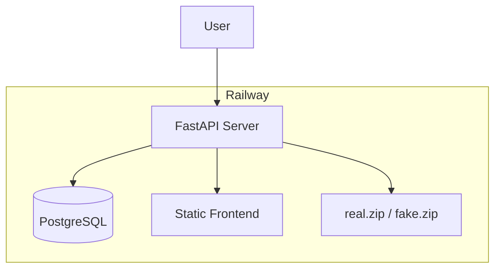
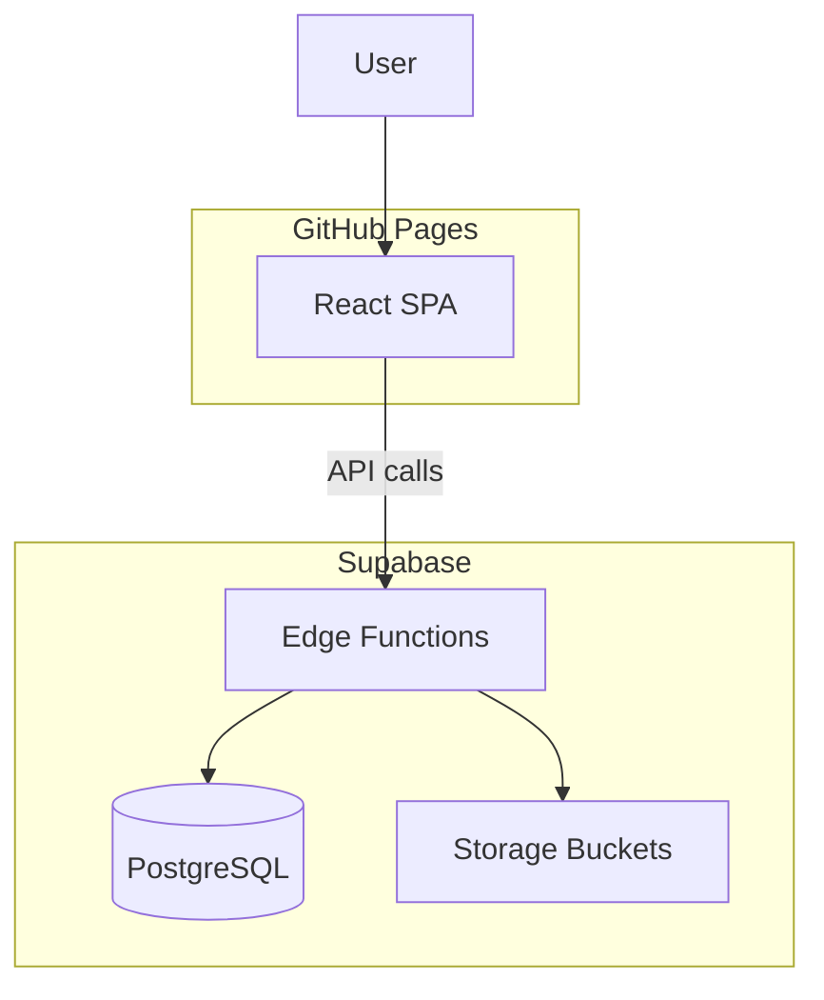

# Migration Plan: Railway to Supabase + GitHub Pages

## Current Architecture (Railway)




- **Single deployment**: Nixpacks builds frontend, copies to `backend/static/`, runs Uvicorn
- **Database**: PostgreSQL (Railway Postgres)
- **Images**: Served from `real.zip` and `fake.zip` via random sampling + base64
- **Leaderboard**: Custom ranking logic (window functions, user insertion)

---

## Target Architecture




| Component       | From                | To                               |
| --------------- | ------------------- | -------------------------------- |
| Frontend        | Railway (static)    | GitHub Pages                     |
| Database        | Railway Postgres    | Supabase PostgreSQL              |
| Images          | Zip files on server | Supabase Storage + Edge Function |
| Leaderboard API | FastAPI             | Supabase Edge Functions          |


---

## Phase 1: Supabase Setup

### 1.1 Create Supabase Project

- Create project at [supabase.com](https://supabase.com)
- Note: Project URL, anon key, service role key

### 1.2 Database Migration

Create `leaderboard_entries` table in Supabase (matches [backend/api/leaderboard.py](backend/api/leaderboard.py)):

```sql
CREATE TABLE leaderboard_entries (
  id SERIAL PRIMARY KEY,
  name TEXT NOT NULL,
  difficulty TEXT NOT NULL,
  ratio TEXT NOT NULL,
  score FLOAT NOT NULL,
  devicetype TEXT NOT NULL,
  date_time TIMESTAMPTZ DEFAULT NOW()
);

-- Enable RLS; Edge Functions will use service role
ALTER TABLE leaderboard_entries ENABLE ROW LEVEL SECURITY;
```

**Data migration**: Export from Railway Postgres, import to Supabase (pg_dump/pg_restore or Supabase SQL editor).

### 1.3 Storage Setup

- Create buckets: `real-images`, `fake-images` (or `images` with folders)
- Extract `real.zip` and `fake.zip` from [backend/data/](backend/data/) and upload
- Set bucket policies: public read for images (or use signed URLs via Edge Function)

### 1.4 Edge Functions

Create two Edge Functions in `supabase/functions/`:

**a) `images`** – Replace [backend/api/images.py](backend/api/images.py):

- Accept `count` and `real` query params
- List objects from Storage bucket, random sample, read and base64-encode
- Return `[{ image_id, image_data, is_real }]` (same shape as current API)

**b) `leaderboard`** – Replace [backend/api/leaderboard.py](backend/api/leaderboard.py) + routes:

- **GET**: Query `leaderboard_entries`, compute ranks (SQL window function), insert user row, return top_n + user context
- **POST**: Insert new entry, return `{ id, name, score, difficulty, message }`

Edge Functions URL: `https://<project-ref>.supabase.co/functions/v1/<function-name>`

---

## Phase 2: Frontend Changes

### 2.1 API Client Update

Modify [frontend/src/hooks/useHTTP.ts](frontend/src/hooks/useHTTP.ts):

- Set `VITE_API_URL` to Supabase Edge Functions base: `https://<project-ref>.supabase.co/functions/v1`
- API paths stay the same: `/images`, `/leaderboard` (append to base)

### 2.2 Vite Base Path

Update [frontend/vite.config.ts](frontend/vite.config.ts) for GitHub Pages:

```ts
base: process.env.GITHUB_ACTIONS ? '/NeuralNector/' : '/',
```

Or use `/` if deploying with custom domain (e.g., neuralnector.com).

### 2.3 Environment Variables

- Add `.env.production` (or GitHub Actions secrets): `VITE_API_URL=https://<project-ref>.supabase.co/functions/v1`
- No Supabase anon key needed in frontend if Edge Functions are invoked directly (CORS allows origin)

---

## Phase 3: GitHub Pages Deployment

### 3.1 GitHub Actions Workflow

Create `.github/workflows/deploy.yml`:

```yaml
name: Deploy to GitHub Pages
on:
  push:
    branches: [main]
jobs:
  deploy:
    runs-on: ubuntu-latest
    steps:
      - uses: actions/checkout@v4
      - uses: actions/setup-node@v4
        with:
          node-version: '22'
          cache: 'npm'
          cache-dependency-path: frontend/package-lock.json
      - run: cd frontend && npm ci && npm run build
        env:
          VITE_API_URL: ${{ secrets.VITE_API_URL }}
      - uses: peaceiris/actions-gh-pages@v4
        with:
          github_token: ${{ secrets.GITHUB_TOKEN }}
          publish_dir: frontend/dist
```

### 3.2 Repository Settings

- **Settings > Pages**: Source = "GitHub Actions"
- Add `VITE_API_URL` to **Settings > Secrets and variables > Actions**

### 3.3 CORS

Configure Supabase Edge Functions to allow:

- `https://<username>.github.io`
- `https://neuralnector.com` (if using custom domain)

---

## Phase 4: Cleanup and Validation

### 4.1 Remove Railway Artifacts

- Delete or archive `railway.json`, `nixpacks.toml`
- Remove `backend/static/` from build (no longer needed)
- Optionally keep `backend/` for local dev or remove if fully migrated

### 4.2 Testing Checklist

- Images load correctly (real/fake, random selection)
- Leaderboard GET returns ranked entries with user row
- Leaderboard POST submits scores
- Frontend loads on GitHub Pages URL
- CORS works from GitHub Pages origin

---

## File Changes Summary


| Action | File                                      |
| ------ | ----------------------------------------- |
| Create | `supabase/functions/images/index.ts`      |
| Create | `supabase/functions/leaderboard/index.ts` |
| Create | `.github/workflows/deploy.yml`            |
| Modify | `frontend/vite.config.ts` (base path)     |
| Modify | `frontend/src/hooks/useHTTP.ts` (API URL) |
| Create | `frontend/.env.production.example`        |
| Remove | `railway.json`, `nixpacks.toml`           |


---

## Considerations

1. **Custom domain**: If using neuralnector.com, configure GitHub Pages custom domain and set `base: '/'` in Vite.
2. **Image storage size**: Ensure `real.zip` and `fake.zip` fit within Supabase Storage limits (free tier: 1GB).
3. **Edge Function cold starts**: First request may be slower; acceptable for a game.
4. **Local development**: Keep a minimal backend or use Supabase local (`supabase start`) for dev.

