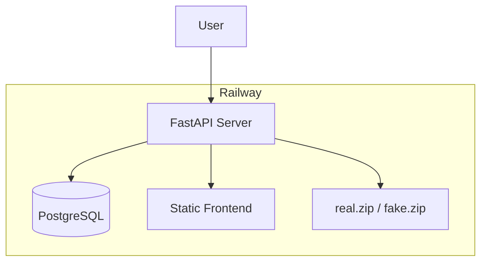
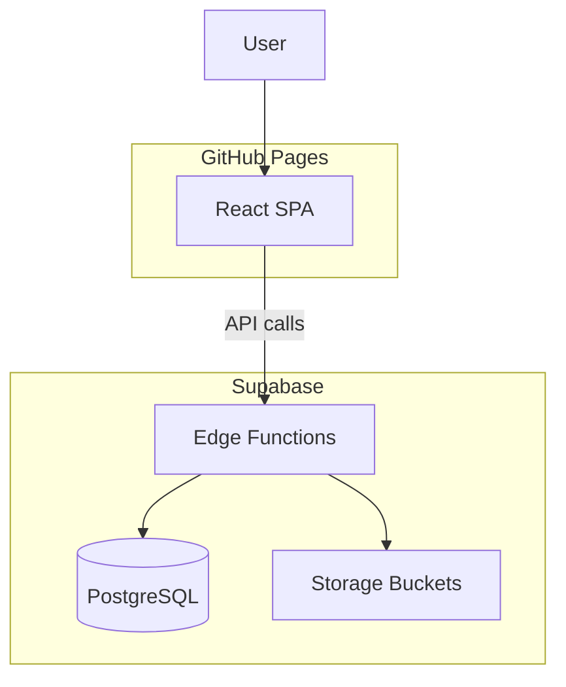

# Migration Plan: Railway to Supabase + GitHub Pages

## Current Architecture (Railway)




- **Single deployment**: Nixpacks builds frontend, copies to `backend/static/`, runs Uvicorn
- **Database**: PostgreSQL (Railway Postgres)
- **Images**: Served from `real.zip` and `fake.zip` via random sampling + base64
- **Leaderboard**: Custom ranking logic (window functions, user insertion)

---

## Target Architecture




| Component       | From                | To                                                          |
| --------------- | ------------------- | ----------------------------------------------------------- |
| Frontend        | Railway (static)    | GitHub Pages                                                |
| Database        | Railway Postgres    | Supabase PostgreSQL                                         |
| Images          | Zip files on server | Supabase Storage (Images/real, Images/fake) + Edge Function |
| Leaderboard API | FastAPI             | Supabase Edge Functions                                     |


---

## Phase 1: Supabase Setup

### 1.1 Create Supabase Project (Done)

- Project created at [supabase.com](https://supabase.com)
- Environment variables in `.env`:
  - `VITE_SUPABASE_URL` – Supabase project URL (e.g. `https://<project-ref>.supabase.co`)
  - `VITE_SUPABASE_PUBLISHABLE_DEFAULT_KEY` – Anon/publishable key for Edge Function requests

### 1.2 Database Migration

Migration file created: [supabase/migrations/20250318120000_create_leaderboard_entries.sql](supabase/migrations/20250318120000_create_leaderboard_entries.sql)

Run with `supabase db push` or apply via Supabase Dashboard SQL editor.

**Data migration**: Export from Railway Postgres, import to Supabase (pg_dump/pg_restore or Supabase SQL editor).

### 1.3 Storage Setup

- **Bucket**: `Images` (already exists per user)
- **Folders**: `real/` and `fake/` inside the Images bucket
- Images are served via the `images` Edge Function (no public URL needed; function uses service role)

### 1.4 Edge Functions (Implemented)

**a) `images`** – [supabase/functions/images/index.ts](supabase/functions/images/index.ts)

- Reads from `Images` bucket, `real/` or `fake/` folder based on `real` query param
- Accepts `count` (1–100) and `real` (true/false)
- Lists files, random sample, downloads, base64-encodes
- Returns `[{ image_id, image_data, is_real }]` (same shape as current API)

**b) `leaderboard`** – [supabase/functions/leaderboard/index.ts](supabase/functions/leaderboard/index.ts)

- **GET**: `difficulty`, `top_n`, `user_score` (optional), `user_id` (optional)
- **POST**: Body `{ name, difficulty, ratio, score, devicetype }`
- Replicates ranking logic from [backend/api/leaderboard.py](backend/api/leaderboard.py) (user insertion, separator row, top_n + context)

Deploy with `supabase functions deploy images` and `supabase functions deploy leaderboard`.

---

## Phase 2: Frontend Changes

### 2.1 API Client Update

Modify [frontend/src/hooks/useHTTP.ts](frontend/src/hooks/useHTTP.ts):

- API base: `${VITE_SUPABASE_URL}/functions/v1` (e.g. `https://<project-ref>.supabase.co/functions/v1`)
- Add headers: `Authorization: Bearer ${VITE_SUPABASE_PUBLISHABLE_DEFAULT_KEY}` and `apikey: ${VITE_SUPABASE_PUBLISHABLE_DEFAULT_KEY}` for Edge Function auth
- API paths stay the same: `/images`, `/leaderboard` (append to base)

### 2.2 Vite Base Path

Update [frontend/vite.config.ts](frontend/vite.config.ts) for GitHub Pages:

```ts
base: process.env.GITHUB_ACTIONS ? '/NeuralNector/' : '/',
```

Or use `/` if deploying with custom domain (e.g., neuralnector.com).

### 2.3 Environment Variables

- **Local**: `frontend/.env` or root `.env` with `VITE_SUPABASE_URL` and `VITE_SUPABASE_PUBLISHABLE_DEFAULT_KEY` (already set)
- **GitHub Actions**: Add secrets `VITE_SUPABASE_URL` and `VITE_SUPABASE_PUBLISHABLE_DEFAULT_KEY` in **Settings > Secrets and variables > Actions**

---

## Phase 3: GitHub Pages Deployment

### 3.1 GitHub Actions Workflow

Create `.github/workflows/deploy.yml`:

```yaml
name: Deploy to GitHub Pages
on:
  push:
    branches: [main]
jobs:
  deploy:
    runs-on: ubuntu-latest
    steps:
      - uses: actions/checkout@v4
      - uses: actions/setup-node@v4
        with:
          node-version: '22'
          cache: 'npm'
          cache-dependency-path: frontend/package-lock.json
      - run: cd frontend && npm ci && npm run build
        env:
          VITE_SUPABASE_URL: ${{ secrets.VITE_SUPABASE_URL }}
          VITE_SUPABASE_PUBLISHABLE_DEFAULT_KEY: ${{ secrets.VITE_SUPABASE_PUBLISHABLE_DEFAULT_KEY }}
      - uses: peaceiris/actions-gh-pages@v4
        with:
          github_token: ${{ secrets.GITHUB_TOKEN }}
          publish_dir: frontend/dist
```

### 3.2 Repository Settings

- **Settings > Pages**: Source = "GitHub Actions"
- Add `VITE_SUPABASE_URL` and `VITE_SUPABASE_PUBLISHABLE_DEFAULT_KEY` to **Settings > Secrets and variables > Actions**

### 3.3 CORS

Configure Supabase Edge Functions to allow:

- `https://<username>.github.io`
- `https://neuralnector.com` (if using custom domain)

---

## Phase 4: Cleanup and Validation

### 4.1 Remove Railway Artifacts

- Delete or archive `railway.json`, `nixpacks.toml`
- Remove `backend/static/` from build (no longer needed)
- Optionally keep `backend/` for local dev or remove if fully migrated

### 4.2 Testing Checklist

- Images load correctly (real/fake, random selection)
- Leaderboard GET returns ranked entries with user row
- Leaderboard POST submits scores
- Frontend loads on GitHub Pages URL
- CORS works from GitHub Pages origin

---

## File Changes Summary


| Action | File                                                                               |
| ------ | ---------------------------------------------------------------------------------- |
| Create | `supabase/migrations/20250318120000_create_leaderboard_entries.sql`                |
| Create | `supabase/functions/images/index.ts`                                               |
| Create | `supabase/functions/leaderboard/index.ts`                                          |
| Create | `.github/workflows/deploy.yml`                                                     |
| Modify | `frontend/vite.config.ts` (base path)                                              |
| Modify | `frontend/src/hooks/useHTTP.ts` (API URL)                                          |
| Create | `frontend/.env.example` (VITE_SUPABASE_URL, VITE_SUPABASE_PUBLISHABLE_DEFAULT_KEY) |
| Remove | `railway.json`, `nixpacks.toml`                                                    |


---

## Considerations

1. **Custom domain**: If using neuralnector.com, configure GitHub Pages custom domain and set `base: '/'` in Vite.
2. **Images bucket**: Ensure `Images` bucket has `real/` and `fake/` folders with .jpg/.jpeg/.png files. Storage free tier: 1GB.
3. **Edge Function cold starts**: First request may be slower; acceptable for a game.
4. **Local development**: Use `supabase start` and `supabase functions serve` for local Edge Functions.

