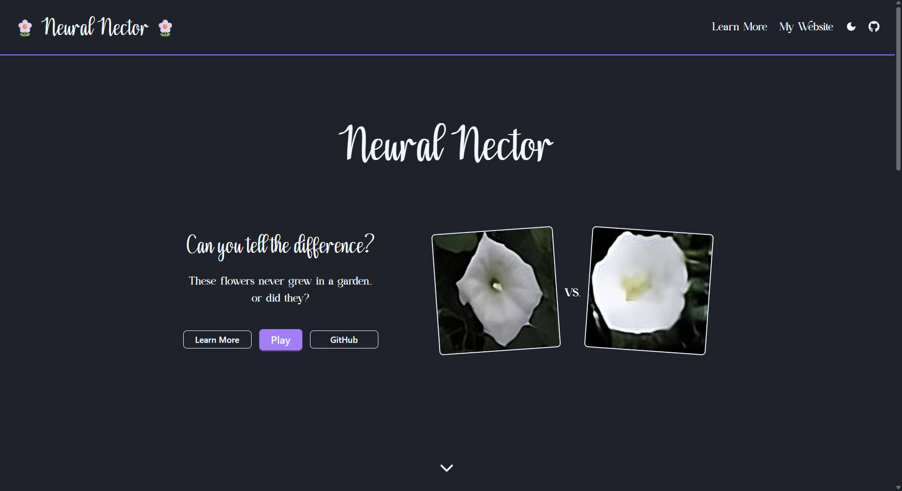
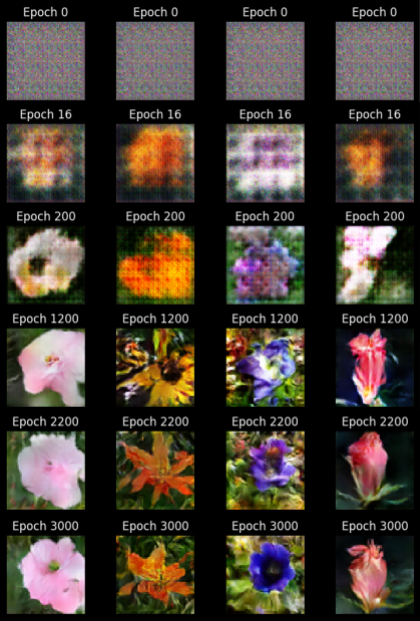

<h1 align="center">Neural Nector - Can you tell the difference?</h1>

[Neural Nector](https://neuralnector.com) is an interactive web game that challenges players to identify AI-generated (fake) flowers from real ones. Test your perception skills as you navigate through different difficulty levels, compete on leaderboards, and see if you can spot the difference! 

Check out this project on my website [here](https://www.issacroy.com/neural-nector). For more technical details, check out the [report](https://www.neuralnector.com/report).

## 🎮 Game Overview 

The game presents you with a grid of flower images - some are real photographs, others are AI-generated. Your task is to select all the fake (AI-generated) flowers before time runs out. The game features:

- **Multiple Difficulty Levels**: Easy (2x2), Normal (4x4), Hard (6x6), and Impossible (8x8)
- **Two Ratio Modes**: 
  - Equal Ratio: 50/50 split of real and fake flowers
  - Random Ratio: Variable ratio with bonus scoring
- **Dynamic Scoring**: Based on how well you identify fake images and completion time
- **Global Leaderboards**: Compete with players worldwide, filtered by difficulty
- **Responsive Design**: Works seamlessly on desktop, tablet, and mobile devices

## 🎯 How to Play

1. **Select Difficulty**: Choose your board size (Easy, Normal, Hard, or Impossible)
2. **Choose Ratio**: Pick between Equal Ratio or Random Ratio (for bonus points)
3. **Start Game**: Click "Start" to reveal the flower images
4. **Select Fake Flowers**: Click on all the AI-generated flowers you can identify
5. **Submit**: Click "Submit" when you're done
6. **Review**: Watch as your selections are reviewed one by one
7. **View Score**: See your final score and submit it to the leaderboard!

## 📊 Scoring System

Your score is calculated based on two factors:

- **F1 Score (0-50 points)**: A balanced metric that considers both precision and recall
  - Formula: `TP / (TP + 0.5 × (FP + FN)) × 50`
  - **TP (True Positives)**: Correctly identified fake images
  - **FP (False Positives)**: Real images incorrectly selected as fake
  - **FN (False Negatives)**: Fake images you missed
  - Perfect F1 score (1.0) = 50 points

- **Time Bonus (0-50 points)**: Based on how quickly you complete the game
  - Maximum time limits: Easy (10s), Normal (30s), Hard (60s), Impossible (120s)
  - Faster completion = higher bonus (up to 50 points)

- **Ratio Multiplier**: 
  - **Random Ratio**: Applies a multiplier that adds bonus points (up to 25 base points)
  - **Equal Ratio**: No multiplier, raw score only

Final score = (F1 Score + Time Bonus) × Ratio Multiplier + Ratio Base Score

## Samples from Training

**Can you tell the difference?** Play [NeuralNector](https://neuralnector.com) and find out! 🌸
